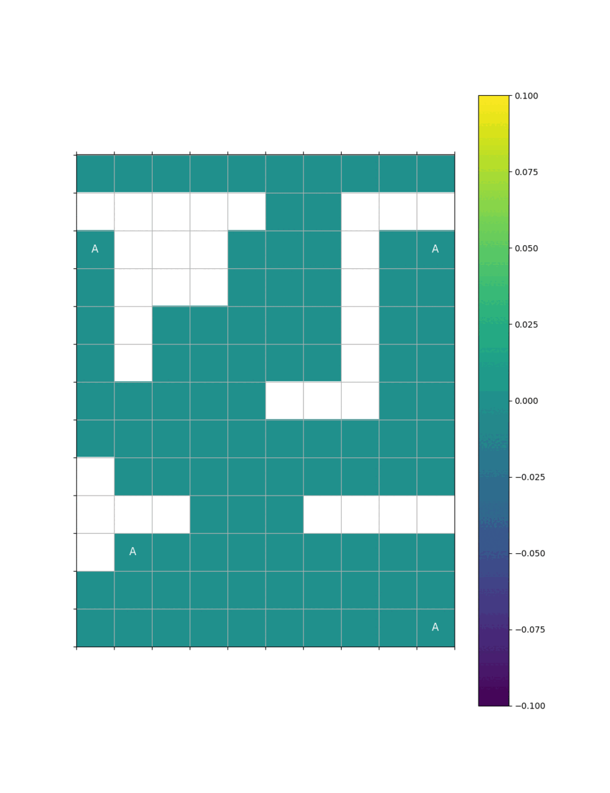

# Reinforcement-Learning - Maze
-----

What we're trying to do is teach an agent about the environment. It's an opportunity to learn about the different types of 
reinforcement learning. 

# Dynamic Programming
This is quite cool, essentially this one allows us to use two attributes mainly the Reward matrix 


- **Reward Matrix**: The immediate reward you get from taking action a in state s and getting to state s'
- **Probability Transition Matrix**: The probability of going to state s' from s taking action a

Once you have each of these you can understand a value function over the whole environment.




# Monte Carlo
Different to Dynamic Programming, we're tweaking several different parameters. 

```python
MC_Visits = [True, False] # First visit, every visit
MC_Episodes_in_Batch = [1,2,3,4,5]
MC_Exploration_Params = [ i/100 for i in range(0, 105, 5)]
MC_Exploration_Decay = [ i / 1000 for i in range(1000, 950, -5)]
MC_Batch_Limit = [i for i in range(1000, 10000, 1000)]
MC_Policy_Improvement_Type = ["E-GREEDY", "COMBINATION", "SOFT-MAX"]
```

Tweaking these hyper parameters we can find a set up which works best for Monte Carlo Simulation.